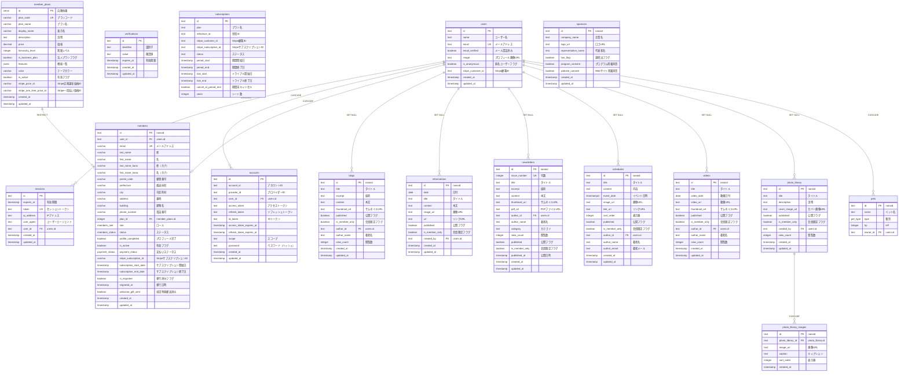

# ER図

```mermaid
erDiagram
    %% ========== Enum定義（コメント） ==========
    %% members_role: admin, officer, member
    %% members_status: pending_profile, active, inactive
    %% payment_status: pending, completed, failed, canceled
    %% pet_type: dog, cat

    %% ========== Better Auth 管理テーブル ==========

    users {
        text id PK
        text name "ユーザー名"
        text email UK "メールアドレス"
        boolean email_verified "メール認証済み"
        text image "プロフィール画像URL"
        boolean is_anonymous "匿名ユーザーフラグ"
        text stripe_customer_id "Stripe顧客ID"
        timestamp created_at
        timestamp updated_at
    }

    sessions {
        text id PK
        timestamp expires_at "有効期限"
        text token UK "セッショントークン"
        text ip_address "IPアドレス"
        text user_agent "ユーザーエージェント"
        text user_id FK "users.id"
        timestamp created_at
        timestamp updated_at
    }

    accounts {
        text id PK
        text account_id "アカウントID"
        text provider_id "プロバイダーID"
        text user_id FK "users.id"
        text access_token "アクセストークン"
        text refresh_token "リフレッシュトークン"
        text id_token "IDトークン"
        timestamp access_token_expires_at
        timestamp refresh_token_expires_at
        text scope "スコープ"
        text password "パスワード（ハッシュ）"
        timestamp created_at
        timestamp updated_at
    }

    verifications {
        text id PK
        text identifier "識別子"
        text value "確認値"
        timestamp expires_at "有効期限"
        timestamp created_at
        timestamp updated_at
    }

    subscriptions {
        text id PK
        text plan "プラン名"
        text reference_id "参照ID"
        text stripe_customer_id "Stripe顧客ID"
        text stripe_subscription_id "StripeサブスクリプションID"
        text status "ステータス"
        timestamp period_start "期間開始日"
        timestamp period_end "期間終了日"
        timestamp trial_start "トライアル開始日"
        timestamp trial_end "トライアル終了日"
        boolean cancel_at_period_end "期間末キャンセル"
        integer seats "シート数"
    }

    %% ========== 会員管理 ==========

    members {
        text id PK "nanoid"
        text user_id FK "users.id"
        varchar email UK "メールアドレス"
        varchar last_name "姓"
        varchar first_name "名"
        varchar last_name_kana "姓（カナ）"
        varchar first_name_kana "名（カナ）"
        varchar postal_code "郵便番号"
        varchar prefecture "都道府県"
        varchar city "市区町村"
        varchar address "番地"
        varchar building "建物名"
        varchar phone_number "電話番号"
        integer plan_id FK "member_plans.id"
        members_role role "ロール"
        members_status status "ステータス"
        boolean profile_completed "プロフィール完了"
        boolean is_active "有効フラグ"
        payment_status payment_status "支払いステータス"
        varchar stripe_subscription_id "StripeサブスクリプションID"
        timestamp subscription_start_date "サブスクリプション開始日"
        timestamp subscription_end_date "サブスクリプション終了日"
        boolean is_migrated "移行済みフラグ"
        timestamp migrated_at "移行日時"
        boolean welcome_gift_sent "初回特典郵送済み"
        timestamp created_at
        timestamp updated_at
    }

    member_plans {
        serial id PK "自動採番"
        varchar plan_code UK "プランコード"
        varchar plan_name "プラン名"
        varchar display_name "表示名"
        text description "説明"
        decimal price "価格"
        integer hierarchy_level "階層レベル"
        boolean is_business_plan "法人プランフラグ"
        jsonb features "機能一覧"
        varchar color "テーマカラー"
        boolean is_active "有効フラグ"
        varchar stripe_price_id "Stripe定期課金価格ID"
        varchar stripe_one_time_price_id "Stripe一括払い価格ID"
        timestamp created_at
        timestamp updated_at
    }

    %% ========== コンテンツ ==========

    blogs {
        text id PK "nanoid"
        text title "タイトル"
        text excerpt "抜粋"
        text content "本文"
        text thumbnail_url "サムネイルURL"
        boolean published "公開フラグ"
        boolean is_member_only "会員限定フラグ"
        text author_id FK "users.id"
        text author_name "著者名"
        integer view_count "閲覧数"
        timestamp created_at
        timestamp updated_at
    }

    informations {
        text id PK "nanoid"
        date date "日付"
        text title "タイトル"
        text content "本文"
        text image_url "画像URL"
        text url "リンクURL"
        boolean published "公開フラグ"
        boolean is_member_only "会員限定フラグ"
        text created_by FK "users.id"
        timestamp created_at
        timestamp updated_at
    }

    newsletters {
        text id PK "nanoid"
        integer issue_number UK "号数"
        text title "タイトル"
        text excerpt "抜粋"
        text content "本文"
        text thumbnail_url "サムネイルURL"
        text pdf_url "PDFファイルURL"
        text author_id FK "users.id"
        text author_name "著者名"
        text category "カテゴリ"
        integer view_count "閲覧数"
        boolean published "公開フラグ"
        boolean is_member_only "会員限定フラグ"
        timestamp published_at "公開日時"
        timestamp created_at
        timestamp updated_at
    }

    schedules {
        text id PK "nanoid"
        text title "タイトル"
        text content "内容"
        timestamptz event_date "イベント日時"
        text image_url "画像URL"
        text link_url "リンクURL"
        integer sort_order "表示順"
        boolean published "公開フラグ"
        boolean is_member_only "会員限定フラグ"
        text author_id FK "users.id"
        text author_name "著者名"
        text author_email "著者メール"
        timestamp created_at
        timestamp updated_at
    }

    videos {
        text id PK "nanoid"
        text title "タイトル"
        date video_date "動画日付"
        text video_url "動画URL"
        text thumbnail_url "サムネイルURL"
        boolean published "公開フラグ"
        boolean is_member_only "会員限定フラグ"
        text author_id FK "users.id"
        text author_name "著者名"
        integer view_count "閲覧数"
        timestamp created_at
        timestamp updated_at
    }

    photo_library {
        text id PK "nanoid"
        text title "タイトル"
        text description "説明"
        text cover_image_url "カバー画像URL"
        boolean published "公開フラグ"
        boolean is_member_only "会員限定フラグ"
        text created_by FK "users.id"
        integer view_count "閲覧数"
        timestamp created_at
        timestamp updated_at
    }

    photo_library_images {
        text id PK "nanoid"
        text photo_library_id FK "photo_library.id"
        text image_url "画像URL"
        text caption "キャプション"
        integer sort_order "表示順"
        timestamp created_at
    }

    %% ========== その他 ==========

    sponsors {
        text id PK "nanoid"
        text company_name "企業名"
        text logo_url "ロゴURL"
        text representative_name "代表者名"
        boolean has_flag "旗掲出フラグ"
        boolean program_consent "プログラム掲載同意"
        boolean website_consent "Webサイト掲載同意"
        timestamp created_at
        timestamp updated_at
    }

    pets {
        text id PK "nanoid"
        text name "ペット名"
        pet_type type "種別"
        integer hp "HP"
        text owner_id FK "users.id"
    }

    %% ========== リレーション ==========

    users ||--o{ sessions : "CASCADE"
    users ||--o{ accounts : "CASCADE"
    users ||--o| members : "CASCADE"
    users ||--o{ blogs : "SET NULL"
    users ||--o{ informations : "SET NULL"
    users ||--o{ newsletters : "SET NULL"
    users ||--o{ schedules : "SET NULL"
    users ||--o{ videos : "SET NULL"
    users ||--o{ photo_library : "SET NULL"
    users ||--o{ pets : "CASCADE"

    member_plans ||--o{ members : "RESTRICT"

    photo_library ||--o{ photo_library_images : "CASCADE"
```
