# ユーザー登録フロー図

## 概要

本ドキュメントでは、新規ユーザーが会員登録を完了するまでの一連の流れを、ユーザー・フロントエンド・バックエンド・データベースの4者間のシーケンス図で示す。

## 登録方法

ユーザーは以下の3つの方法でアカウントを作成できる：

- **パターンA**: メール + パスワード登録
- **パターンB**: Google OAuth 登録
- **パターンC**: LINE OAuth 登録

## フロー図（全体）

```mermaid
sequenceDiagram
    actor User as ユーザー
    participant FE as フロントエンド
    participant BE as バックエンド
    participant DB as データベース

    Note over User, DB: ===== STEP 1: 利用規約同意 =====

    User->>FE: /register/terms にアクセス
    FE->>User: 利用規約画面を表示
    User->>FE: 規約を確認し「同意する」をチェック
    FE->>FE: RegistrationContext に termsAgreed=true を保存<br/>(localStorage永続化)
    FE->>User: /register/plan へ遷移

    Note over User, DB: ===== STEP 2: プラン選択 =====

    FE->>BE: getMemberPlans() サーバーアクション呼び出し
    BE->>DB: SELECT * FROM member_plans WHERE is_active = true
    DB-->>BE: プラン一覧
    BE-->>FE: プラン一覧データ
    FE->>User: プラン選択画面を表示<br/>(個人/法人/プラチナ個人/プラチナ法人)
    User->>FE: プランを選択
    FE->>FE: RegistrationContext に selectedPlanId を保存
    FE->>User: /register/auth へ遷移

    Note over User, DB: ===== STEP 3: アカウント作成 =====

    alt パターンA: メール+パスワード登録
        User->>FE: 名前・メール・パスワードを入力し送信
        FE->>BE: authClient.signUp.email()<br/>(Better Auth API)
        BE->>DB: INSERT INTO users (name, email, emailVerified, ...)
        DB-->>BE: ユーザーレコード
        BE->>DB: INSERT INTO accounts (userId, providerId="credential", ...)
        DB-->>BE: アカウントレコード
        BE->>DB: INSERT INTO sessions (userId, token, expiresAt, ...)
        DB-->>BE: セッションレコード
        BE-->>FE: signUp成功レスポンス + セッションCookie
        FE->>BE: createMemberAfterSignup(userId, email, planId)<br/>サーバーアクション
        BE->>DB: SELECT * FROM members WHERE user_id = ?
        DB-->>BE: null (未登録)
        BE->>DB: INSERT INTO members<br/>(userId, email, planId,<br/>role="member", status="pending_profile",<br/>paymentStatus="pending")
        DB-->>BE: memberレコード
        BE-->>FE: 成功レスポンス
        FE->>FE: RegistrationContext に accountCreated=true を保存
        FE->>User: /register/payment へ遷移

    else パターンB: Google OAuth 登録
        User->>FE: 「Googleで登録」ボタンをクリック
        FE->>BE: authClient.signIn.social({provider: "google"})<br/>callbackURL=/register/callback?planId=N
        BE-->>User: Google OAuth 認可画面へリダイレクト
        User->>User: Googleアカウントを選択・認可
        User->>BE: Google → callbackURL にリダイレクト
        BE->>DB: INSERT INTO users (name, email, image, ...)
        DB-->>BE: ユーザーレコード
        BE->>DB: INSERT INTO accounts (userId, providerId="google", ...)
        DB-->>BE: アカウントレコード
        BE->>DB: INSERT INTO sessions (userId, token, ...)
        DB-->>BE: セッションレコード
        BE-->>FE: /register/callback?planId=N へリダイレクト + セッションCookie
        FE->>BE: セッション情報を取得
        BE-->>FE: userId, email
        FE->>BE: createMemberAfterSignup(userId, email, planId)
        BE->>DB: INSERT INTO members (userId, email, planId, ...)
        DB-->>BE: memberレコード
        BE-->>FE: 成功レスポンス
        FE->>User: /register/payment へ遷移

    else パターンC: LINE OAuth 登録
        User->>FE: 「LINEで登録」ボタンをクリック
        FE->>BE: authClient.signIn.oauth2({providerId: "line"})<br/>callbackURL=/register/callback?planId=N
        BE-->>User: LINE OAuth 認可画面へリダイレクト<br/>(bot_prompt="aggressive")
        User->>User: LINE認可 + 友だち追加(任意)
        User->>BE: LINE → callbackURL にリダイレクト
        BE->>DB: INSERT INTO users (name, email=xxx@line.me, ...)
        DB-->>BE: ユーザーレコード
        BE->>DB: INSERT INTO accounts (userId, providerId="line", ...)
        DB-->>BE: アカウントレコード
        BE->>DB: INSERT INTO sessions (userId, token, ...)
        DB-->>BE: セッションレコード
        BE-->>FE: /register/callback?planId=N へリダイレクト + セッションCookie

        FE->>BE: セッション情報を取得
        BE-->>FE: userId, email

        alt メールが @line.me（ダミーメール）
            FE->>User: /register/email へ遷移<br/>（実メールアドレス入力が必要）
            User->>FE: メールアドレスを入力して送信
            FE->>BE: updateUserEmail(userId, newEmail, planId)
            BE->>DB: SELECT * FROM users WHERE email = newEmail
            DB-->>BE: null (重複なし)
            BE->>DB: UPDATE users SET email = newEmail WHERE id = userId
            DB-->>BE: 更新完了
            BE->>DB: INSERT INTO members (userId, email=newEmail, planId, ...)
            DB-->>BE: memberレコード
            BE-->>FE: 成功レスポンス
        else メールが通常アドレス
            FE->>BE: createMemberAfterSignup(userId, email, planId)
            BE->>DB: INSERT INTO members (userId, email, planId, ...)
            DB-->>BE: memberレコード
            BE-->>FE: 成功レスポンス
        end

        FE->>User: /register/payment へ遷移
    end

    Note over User, DB: ===== STEP 4: 決済 =====

    FE->>BE: getMemberPlanById(planId) でプラン情報取得
    BE->>DB: SELECT * FROM member_plans WHERE id = planId
    DB-->>BE: プラン情報 (stripePriceId, price, ...)
    BE-->>FE: プラン詳細データ
    FE->>User: 決済画面を表示<br/>(プラン名・金額・支払い方法選択)

    alt クレジットカード決済（サブスクリプション）
        User->>FE: 「クレジットカードで支払う」を選択
        FE->>BE: POST /api/stripe/create-checkout<br/>{priceId, mode="subscription",<br/>metadata: {planId, userId}}
        BE->>BE: auth.api.getSession() でセッション検証
        BE->>BE: stripe.checkout.sessions.create()<br/>(mode="subscription",<br/>customer_email=email,<br/>allow_promotion_codes=true)
        BE-->>FE: { url: "https://checkout.stripe.com/..." }
        FE->>User: Stripe Checkout画面へリダイレクト
        User->>User: カード情報を入力し決済を確認

    else 銀行振込（単発決済）
        User->>FE: 「銀行振込で支払う」を選択
        FE->>BE: POST /api/stripe/create-checkout<br/>{priceId, mode="payment",<br/>metadata: {planId, userId}}
        BE->>BE: auth.api.getSession() でセッション検証
        BE->>DB: SELECT stripe_customer_id FROM users WHERE id = userId
        DB-->>BE: stripeCustomerId

        opt stripeCustomerId が null の場合
            BE->>BE: stripe.customers.create({email})
            BE->>DB: UPDATE users SET stripe_customer_id = ? WHERE id = ?
            DB-->>BE: 更新完了
        end

        BE->>BE: stripe.checkout.sessions.create()<br/>(mode="payment",<br/>payment_method_types=["customer_balance"],<br/>bank_transfer: {type: "jp_bank_transfer"})
        BE-->>FE: { url: "https://checkout.stripe.com/..." }
        FE->>User: Stripe Checkout画面へリダイレクト
        User->>User: 銀行振込情報を確認
    end

    Note over User, DB: ===== STEP 5: 決済完了 (Webhook) =====

    User->>BE: Stripe決済成功 → success_url へリダイレクト
    BE-->>FE: /register/payment/success 画面

    par Webhook処理 (非同期)
        BE->>BE: Stripe Webhook: checkout.session.completed
        BE->>DB: SELECT * FROM members WHERE user_id = ?
        DB-->>BE: memberレコード

        alt memberレコードが存在する場合
            BE->>DB: UPDATE members SET<br/>payment_status="completed",<br/>stripe_subscription_id=?,<br/>subscription_start_date=?,<br/>subscription_end_date=?
            DB-->>BE: 更新完了
        else memberレコードが存在しない場合
            BE->>DB: INSERT INTO members<br/>(userId, email, planId,<br/>paymentStatus="completed", ...)
            DB-->>BE: memberレコード
        end
    end

    FE->>User: 「お支払いが完了しました」画面を表示
    User->>FE: 「マイページへ」ボタンをクリック

    Note over User, DB: ===== STEP 6: プロフィール入力 =====

    FE->>BE: getCurrentMember() でステータス確認
    BE->>DB: SELECT * FROM members WHERE user_id = ?
    DB-->>BE: member (status="pending_profile")
    BE-->>FE: memberデータ

    FE->>FE: status="pending_profile" を検出
    FE->>User: /profile/edit へ自動リダイレクト<br/>（プロフィール入力画面）

    User->>FE: 氏名・住所・電話番号等を入力して送信
    FE->>BE: updateProfile() サーバーアクション
    BE->>DB: UPDATE members SET<br/>last_name=?, first_name=?,<br/>postal_code=?, prefecture=?, ...,<br/>profile_completed=true,<br/>status="active"
    DB-->>BE: 更新完了
    BE-->>FE: 成功レスポンス
    FE->>User: /profile へ遷移

    Note over User, DB: ===== 登録完了 =====

    FE->>User: プロフィール画面を表示<br/>（会員登録完了）
```



## 状態遷移まとめ

### members.status の遷移

```
(未作成) → pending_profile → active
```

| 状態 | 説明 | 遷移タイミング |
|------|------|---------------|
| `pending_profile` | 初期状態。プロフィール未入力 | memberレコード作成時 |
| `active` | 有効会員 | プロフィール入力完了時 |
| `inactive` | 無効会員 | 管理者操作またはサブスク解約時 |

### members.paymentStatus の遷移

```
pending → completed
pending → failed
completed → canceled
```

| 状態 | 説明 | 遷移タイミング |
|------|------|---------------|
| `pending` | 未決済 | memberレコード作成時 |
| `completed` | 決済完了 | Stripe Webhook: checkout.session.completed |
| `failed` | 決済失敗 | Stripe Webhook: invoice.payment_failed |
| `canceled` | 解約済み | Stripe Webhook: customer.subscription.deleted |

## 登録コンテキスト（localStorage）

フロントエンドでは `RegistrationContext` を使い、登録フロー中の状態を localStorage に永続化する。

| キー | 型 | 説明 |
|------|------|------|
| `termsAgreed` | boolean | 利用規約への同意状態 |
| `termsAgreedAt` | Date | 同意日時 |
| `selectedPlanId` | number | 選択されたプランID |
| `currentStep` | 1-4 | 現在のステップ番号 |
| `accountCreated` | boolean | アカウント作成済みフラグ |
| `userId` | string | 作成されたユーザーID |

## 関連ファイル

| カテゴリ | ファイルパス |
|---------|------------|
| 利用規約画面 | `app/[locale]/(auth)/register/terms/page.tsx` |
| プラン選択画面 | `app/[locale]/(auth)/register/plan/page.tsx` |
| アカウント作成画面 | `app/[locale]/(auth)/register/auth/page.tsx` |
| メール入力画面(LINE用) | `app/[locale]/(auth)/register/email/page.tsx` |
| 決済画面 | `app/[locale]/(auth)/register/payment/page.tsx` |
| コールバック画面 | `app/[locale]/(auth)/register/callback/page.tsx` |
| 決済成功画面 | `app/[locale]/(auth)/register/payment/success/page.tsx` |
| 登録コンテキスト | `contexts/RegistrationContext.tsx` |
| 会員作成アクション | `actions/members/create-member.ts` |
| メール更新アクション | `actions/members/update-user-email.ts` |
| Checkout API | `app/api/stripe/create-checkout/route.ts` |
| Webhook API | `app/api/stripe/webhook/route.ts` |
| Better Auth設定 | `lib/auth.ts` |
