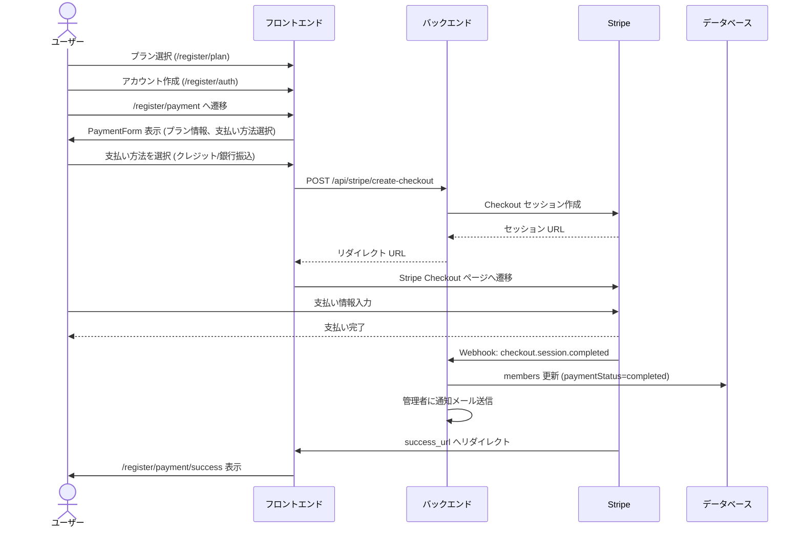

# 課金の仕組み

## 概要

本ドキュメントでは、ik-alumni-club における会員課金の仕組みを説明する。

Better Auth Stripe Plugin と独自の Stripe Webhook を併用した年額課金制で、クレジットカード（定期課金）と銀行振込（一括払い）の 2 方式に対応している。

## 技術スタック

- Better Auth Stripe Plugin
- Stripe Checkout
- Stripe Webhook
- Drizzle ORM + PostgreSQL

## プラン体系

会員プランは `member_plans` テーブルで管理される。

### プラン一覧

| planCode | 表示名 | 年額 | 階層 | 法人 |
| --- | --- | --- | --- | --- |
| individual | 個人会員 | 3,000 円 | 1 | 否 |
| business | 法人会員 | 10,000 円 | 2 | 是 |
| platinum_individual | プラチナ個人会員 | 30,000 円 | 3 | 否 |
| platinum_business | プラチナ法人会員 | 30,000 円 | 3 | 是 |

### プランマスターの主要フィールド

| フィールド | 型 | 説明 |
| --- | --- | --- |
| id | serial | 主キー |
| planCode | varchar(50) | プランコード (unique) |
| planName | varchar(100) | プラン名 |
| displayName | varchar(100) | 表示用名前 |
| description | text | プラン説明 |
| price | decimal(10,2) | 年額価格 (税抜き) |
| hierarchyLevel | integer | プラン階層 (1-3) |
| isBusinessPlan | boolean | 法人プラン判定フラグ |
| features | jsonb | 含まれる機能の配列 |
| color | varchar(20) | テーマカラー |
| stripePriceId | varchar(255) | Stripe 定期課金価格 ID |
| stripeOneTimePriceId | varchar(255) | Stripe 一括払い価格 ID |

各プランは Stripe 側に 2 つの Price を持つ構成となっている。

- stripePriceId: クレジットカード定期課金用
- stripeOneTimePriceId: 銀行振込一括払い用

### 関連ファイル

- db/schemas/member-plans.ts
- types/member-plan.ts
- scripts/seed-member-plans.ts

## 決済方式

### subscription モード (クレジットカード)

- 毎年自動更新
- stripePriceId を使用
- 支払い方法: クレジットカード
- Stripe Subscription が生成され、stripeSubscriptionId が members に保存される

### payment モード (銀行振込)

- 一括払い、1 年間有効
- stripeOneTimePriceId を使用
- 支払い方法: customer_balance + jp_bank_transfer (日本国内専用)
- 事前に Stripe Customer の作成が必須
- 自動更新されないため、1 年後に再度支払い手続きが必要

両モードとも `allow_promotion_codes: true` により、Stripe 側で設定されたプロモーションコードの入力が可能。

### 関連ファイル

- app/api/stripe/create-checkout/route.ts

## 決済フロー

### 新規会員登録フロー

### 既存会員の追加購読フロー

マイページから上位プランへのアップグレードや追加購入を行う。

- URL: /subscribe
- コンポーネント: components/subscribe-button.tsx
- subscription モードでは Better Auth の `subscription.upgrade()` API を呼び出す
- payment モードでは直接 /api/stripe/create-checkout を呼び出す

### 移行ユーザーの決済フロー

旧システムから移行したユーザー (isMigrated = true) は、新規ユーザーと異なる以下のフローを持つ。

- /migrate-login からログイン
- マイページで未支払いの場合、PaymentRegistrationBanner が表示される
- 決済完了後の遷移先: /mypage (新規ユーザーは /register/payment/success)

## 支払い状態の管理

支払い状態は members テーブルで管理される。

### members テーブルの支払い関連フィールド

| フィールド | 型 | デフォルト | 説明 |
| --- | --- | --- | --- |
| paymentStatus | enum | pending | pending / completed / failed / canceled |
| stripeSubscriptionId | varchar(255) | NULL | Stripe サブスク ID (定期払いのみ) |
| subscriptionStartDate | timestamp | NULL | 支払い / サブスク開始日 |
| subscriptionEndDate | timestamp | NULL | 支払い / サブスク終了日 (通常は +1 年) |
| isMigrated | boolean | false | 旧システムからの移行ユーザー判定 |
| migratedAt | timestamp | NULL | 移行日時 |
| welcomeGiftSent | boolean | false | 初回特典郵送済みフラグ |

### Better Auth subscriptions テーブル

Better Auth Stripe Plugin によって自動管理されるテーブル。members テーブルと並行して存在するが、実質的なステータス管理は members 側で行っている。

| フィールド | 説明 |
| --- | --- |
| plan | プラン名 (例: "annual") |
| referenceId | userId への参照 |
| stripeCustomerId | Stripe 顧客 ID |
| stripeSubscriptionId | Stripe サブスク ID |
| status | incomplete / active / canceled |
| periodStart, periodEnd | 課金期間 |

### Stripe Customer の管理

users テーブルの stripeCustomerId フィールドで Stripe 顧客 ID を管理。

- checkout 完了時に Webhook 経由で保存
- payment モードでは Checkout セッション作成前に事前作成が必須

### 関連ファイル

- db/schemas/member.ts
- db/schemas/auth.ts

## Webhook 処理

Stripe からの Webhook イベントは 2 箇所で受信する。

- lib/auth.ts (Better Auth Stripe Plugin の onEvent ハンドラ)
- app/api/stripe/webhook/route.ts (独立した API Route)

両者は同じイベントを処理しており、冗長構成となっている。

### 処理対象イベント

#### checkout.session.completed

checkout 完了時に以下の処理を行う。

subscription モード:

- Stripe subscription を取得し、current_period_start / current_period_end から期間を算出
- members を更新
  - paymentStatus: completed
  - stripeSubscriptionId: subscription.id
  - subscriptionStartDate, subscriptionEndDate
- 管理者に決済完了通知メールを送信

payment モード:

- stripeSubscriptionId は null のまま
- subscriptionEndDate = now + 1 年
- 管理者に決済完了通知メールを送信

#### customer.subscription.deleted

サブスクリプション解約時の処理。

- paymentStatus: canceled
- subscriptionEndDate: now()

#### invoice.payment_failed

支払い失敗時の処理。

- paymentStatus: failed

## 管理者・役員向け機能

### 支払いリセット (管理者)

返金対応後に管理者が実行する操作。

- URL: /admin/accounts/[id]
- コンポーネント: components/admin/reset-payment-button.tsx
- Server Action: actions/admin/accounts/reset-payment.ts

処理内容:

- members テーブルのリセット (paymentStatus: pending, stripeSubscriptionId: null, subscriptionStartDate/EndDate: null)
- Better Auth の subscriptions テーブルから該当レコードを削除

リセット後、ユーザーは /subscribe から再度決済手続きが可能となる。

### 入金状況の一覧表示 (役員)

- URL: /officer/members
- 表示項目: 氏名、メール、電話、住所、会員種別、継続 / 新規 (isMigrated で判定)、入金状況、初回特典郵送済チェックボックス
- paymentStatus によるフィルタリング可能

### 初回特典郵送管理 (役員)

- フィールド: members.welcomeGiftSent
- Server Action: actions/officer/toggle-welcome-gift.ts
- コンポーネント: components/officer/welcome-gift-checkbox.tsx

## 環境変数

.env.example に以下の Stripe 関連変数が定義されている。

- STRIPE_PUBLIC_KEY
- STRIPE_SECRET_KEY
- STRIPE_WEBHOOK_SECRET

## 主要ファイル一覧

### DB スキーマ

- db/schemas/member.ts (会員マスター)
- db/schemas/member-plans.ts (プランマスター)
- db/schemas/auth.ts (users, subscriptions)

### 認証・決済設定

- lib/auth.ts (Better Auth + Stripe Plugin)

### API Routes

- app/api/stripe/create-checkout/route.ts
- app/api/stripe/webhook/route.ts

### Server Actions

- actions/members/get-member.ts
- actions/members/create-member.ts
- actions/members/check-migrated-user.ts
- actions/member-plans/get-member-plans.ts
- actions/admin/accounts/reset-payment.ts
- actions/officer/toggle-welcome-gift.ts

### フロントエンド

- components/register/payment-form.tsx (新規登録決済)
- components/subscribe-button.tsx (既存会員決済)
- components/admin/reset-payment-button.tsx
- components/officer/welcome-gift-checkbox.tsx
- app/[locale]/(auth)/register/payment/page.tsx
- app/[locale]/(auth)/register/payment/success/page.tsx
- app/[locale]/(main)/subscribe/page.tsx
- app/[locale]/(auth)/mypage/page.tsx
- app/[locale]/admin/accounts/[id]/page.tsx
- app/[locale]/officer/members/page.tsx

### 初期データ

- scripts/seed-member-plans.ts

## 課題・改善候補

### Webhook ハンドラの二重化

Stripe Webhook の処理が lib/auth.ts と app/api/stripe/webhook/route.ts の 2 箇所に存在する。同一イベントで 2 回更新される可能性があるため、いずれかに統一することが望ましい。

### subscriptions テーブルと members テーブルの役割重複

Better Auth が管理する subscriptions テーブルと、独自の members テーブルで支払い情報を二重管理している。資料の参照元を明確にし、同期ロジックの責務を整理することで、整合性の維持が容易になる。
