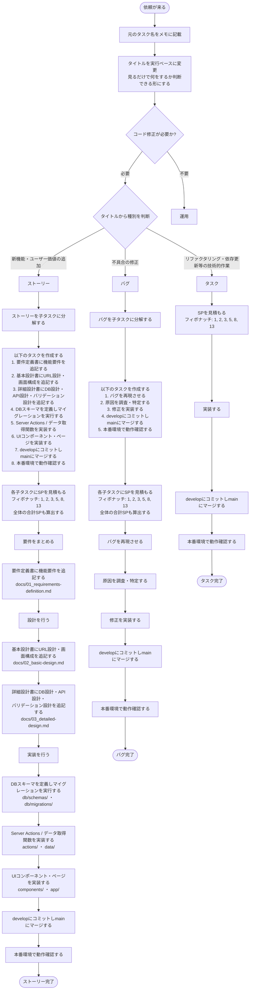

# タスク分解フロー図

## Notion DBプロパティ

| # | プロパティ名 | 型 | 選択肢・備考 |
|---|---|---|---|
| 1 | ID | ID（自動採番） | プレフィックス例: TASK- |
| 2 | タイトル | タイトル | 実行ベースのタスク名 |
| 3 | 元のタスク名 | テキスト | 依頼時の元の名前をメモ |
| 4 | 種別 | セレクト | 開発 / 運用 |
| 5 | 開発種別 | セレクト | ストーリー / バグ / タスク |
| 6 | ステータス | ステータス | 依頼 / 起票済み / タスク洗い出し済み / 進行中 / 完了 |
| 7 | SP | 数値 | フィボナッチ: 1, 2, 3, 5, 8, 13 |
| 8 | 親タスク | リレーション | 自己参照（ストーリー/バグと子タスクの関係） |
| 9 | 合計SP | ロールアップ | 子タスクのSP合計を自動計算 |
| 10 | スプリント | リレーション | スプリントDBと紐付け |
| 11 | 期限 | 日付 | - |
| 12 | 作成日 | 作成日時 | 自動記録 |

## スプリントDB プロパティ

| # | プロパティ名 | 型 | 選択肢・備考 |
|---|---|---|---|
| 1 | ID | ID（自動採番） | プレフィックス例: SPRINT- |
| 2 | スプリント名 | タイトル | 例: Sprint 1 |
| 3 | 期間 | 日付 | 開始日〜終了日（1週間サイクル、月曜〜日曜） |
| 4 | ステータス | ステータス | 計画中 / 進行中 / 完了 |
| 5 | タスク | リレーション | タスクDBと紐付け |
| 6 | 合計SP | ロールアップ | 紐付タスクのSP合計 |
| 7 | 完了SP | ロールアップ | 完了タスクのSP合計 |
